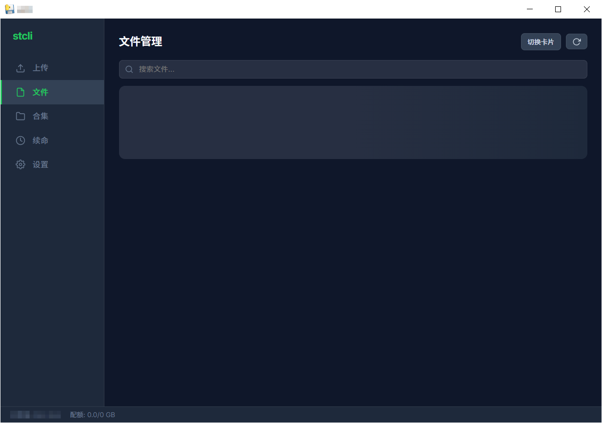
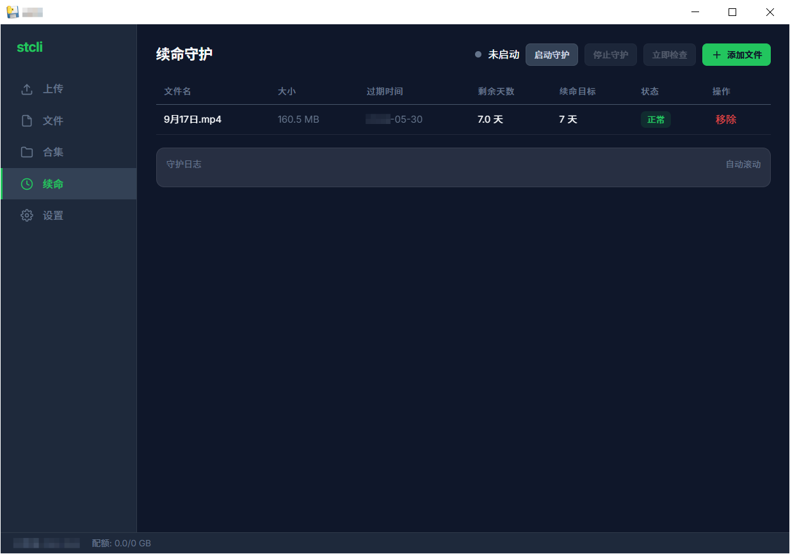

# stcli

[](https://python.org)
[](LICENSE)

storage.to 桌面客户端 — 文件上传、管理、续命一站式工具。

## 功能

- **文件上传** — 支持大文件分片上传，实时进度显示
- **文件管理** — 列表/卡片视图切换，批量操作（下载、删除、修改过期、设置密码）
- **合集管理** — 创建、删除合集，合集链接一键复制
- **续命守护** — 自动检测文件过期时间，到期前自动续命，支持自定义检测间隔
- **CDN 直链** — 一键获取 CDN 下载链接，支持 IDM 等下载工具接管
- **二维码分享** — 生成文件页面二维码，方便手机扫描
- **匿名/账号双模式** — 匿名即可使用，登录后可管理更多文件
- **文件显示模式** — 合并显示、仅本地、仅云端三种模式

## 截图

### 文件管理


### 续命守护


## 安装

### 方式一：直接运行（推荐）

1. 下载 [Releases](https://github.com/yourname/stcli/releases) 中的 `stcli.exe`
2. 双击运行，无需安装 Python

### 方式二：源码运行

```bash
git clone https://github.com/yourname/stcli.git
cd stcli
python -m venv venv
venv\Scripts\activate     # Windows
# source venv/bin/activate  # macOS/Linux
pip install -r requirements.txt
python main.py
```

### 方式三：打包

```bash
pip install pyinstaller
pyinstaller stcli.spec
# 生成文件在 dist/stcli.exe
```

## 使用

启动后自动打开桌面窗口：

1. **上传文件** — 点击"选择文件"或直接拖拽
2. **管理文件** — 切换到"文件"页面，支持搜索、批量操作
3. **续命守护** — 切换到"续命"页面，添加文件后启动守护
4. **设置** — 配置认证方式、下载工具、续命参数等

### 快捷操作

| 操作 | 说明 |
|------|------|
| 点击文件名旁的按钮 | 下载、复制直链、二维码、修改过期等 |
| 勾选多个文件 | 批量下载、批量复制链接、批量修改过期、批量设置密码 |
| 续命"立即检查" | 手动触发一次过期检查，不等待间隔时间 |

## 配置文件

配置存储在 `~/.stcli/` 目录下（Windows: `C:\Users\用户名\.stcli\`）：

```
~/.stcli/
├── config.json        # 主配置（认证、下载方式、续命参数等）
├── owner_tokens.json  # 文件 owner token
├── keepalive.json     # 守护文件列表
└── history.json       # 上传历史
```

## 项目结构

```
stcli/
├── main.py            # 入口文件
├── api/               # storage.to API 客户端
│   ├── client.py      # HTTP 请求封装
│   ├── models.py      # 数据模型
│   └── exceptions.py  # 异常定义
├── core/              # 核心业务逻辑
│   ├── uploader.py    # 文件上传引擎
│   ├── keeper.py      # 续命守护进程
│   ├── store.py       # 本地配置存储
│   └── downloader.py  # 下载工具
├── web/               # Web UI 后端
│   ├── app.py         # Flask 应用 + pywebview 启动
│   └── bridge.py      # Python↔JS 桥接 API
└── static/            # Web UI 前端
    ├── index.html     # 页面结构
    ├── css/style.css  # 样式（Catppuccin 暗色主题）
    └── js/            # 交互逻辑
```

## 技术栈

- **后端：** Python 3.10+, Flask, requests
- **前端：** 原生 HTML/CSS/JS（无框架）
- **桌面：** pywebview (EdgeChromium)
- **打包：** PyInstaller

## 开发

```bash
# 安装依赖
pip install -r requirements.txt

# 运行
python main.py

# 运行测试
pip install pytest
pytest tests/
```

## License

MIT
